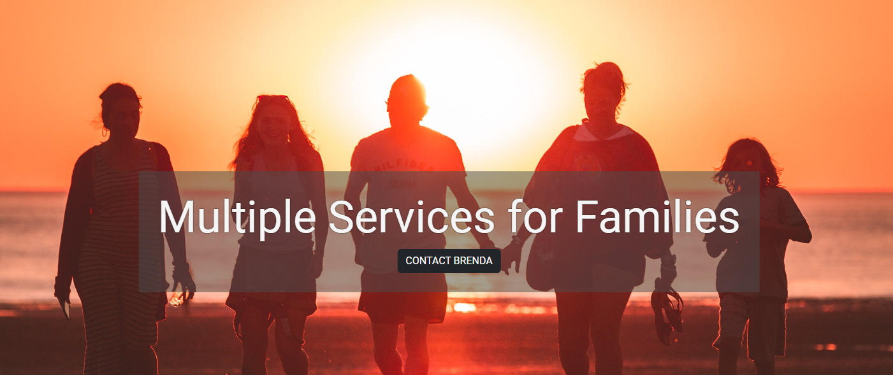

![Version][version]

# KidsVisits

<br/>
<div align='center'>
  <a href="https://kidsvisits.com">
    
  </a>
</div>

## About

Welcome to Brenda Jacobson's Family Services Portfolio, KidsVisits! This website serves as a platform for Brenda Jacobson to showcase the services she offers to families with children. Whether you're seeking guidance, resources, or support, Brenda is here to assist you in navigating the challenges and joys of parenting.

### Built with

[![Svelte][Svelte.dev]][Svelte-url]

## Getting Started

This project is designed to be hosted as a static site on gh-pages

### Installation

1. Clone the repo

```sh
git clone git@github.com:mimi5930/kids-visits.git
```

2. Install packages in root directory

```sh
npm install
```

```sh
bun install
```

3. Run development server

- If using npm

```sh
npm run dev
```

- If using bun (with which I've developed the app)

```sh
bun run bun-dev
```

### Deployment

- If using npm

```sh
npm run build
```

```sh
npm run deploy
```

- If using bun

```sh
bun run bun-build
```

```sh
bun run deploy
```

<!-- MARKDOWN LINKS & IMAGES -->

[version]: https://img.shields.io/badge/Version-2.2-green?style=flat-square
[Svelte.dev]: https://img.shields.io/badge/Sveltekit-4A4A55?style=for-the-badge&logo=svelte
[Svelte-url]: https://kit.svelte.dev/
